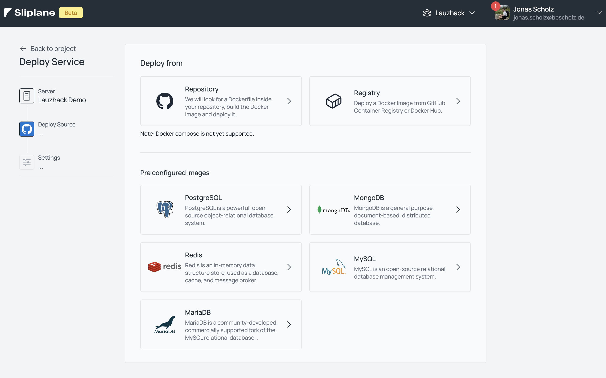
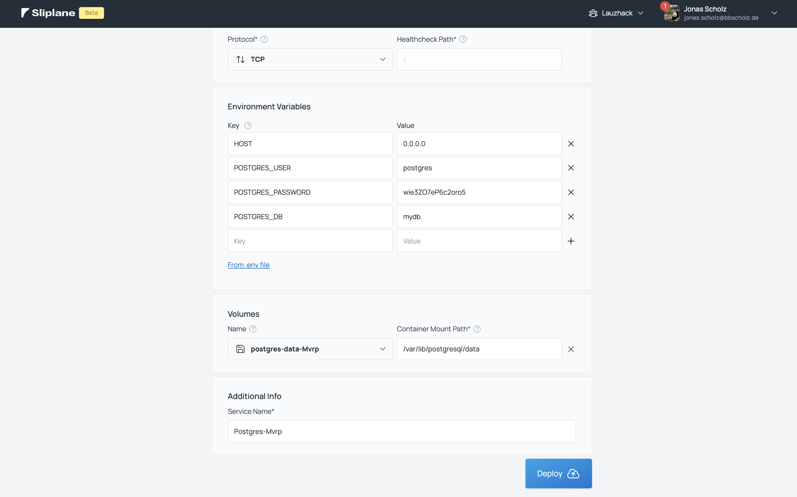

## Getting Started

Prerequisites:

- Node.js / NPM / NPX
- Postgres

1. Clone the repository, yeet the initial repository (rm -rf .git), and initialize a new one. Push it to your own repository.

```bash
git clone https://github.com/Code42Cate/lauzhack-hackathon.git
cd lauzhack-hackathon
rm -rf .git
git init
git add .
git commit -m "Initial commit"
git branch -M main
git remote add origin https://github.com/YOUR_USERNAME/lauzhack-hackathon.git
git push -u origin main
```

2. Run the development server:

```bash
npm install
npm run dev
```

Open [http://localhost:3000](http://localhost:3000) with your browser to see the result.

You will probably need a `.env` file to run the development server.

```
DATABASE_URL=
OPENAI_API_KEY=optional
```

You can either run a local postgres database or deploy on [sliplane.io](https://sliplane.io), or literally any other platform that offers postgres.






Get the password, db and host from the sliplane dashboard. Then put it in your `.env` file.

```bash
npx prisma db push
```

## GUI for database

```bash
npx prisma studio
```

## Add component

Find components here: https://ui.shadcn.com/

```bash
npx shadcn@latest add <component>
```

## Learn More

To learn more about Next.js, take a look at the following resources:

- [Next.js Documentation](https://nextjs.org/docs) - learn about Next.js features and API.
- [Shadcn](https://ui.shadcn.com/) - components
- [Prisma](https://www.prisma.io/docs/getting-started) - database
- [AI](https://sdk.vercel.ai/) - AI
